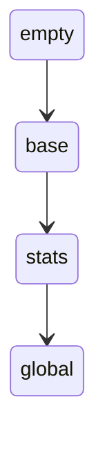
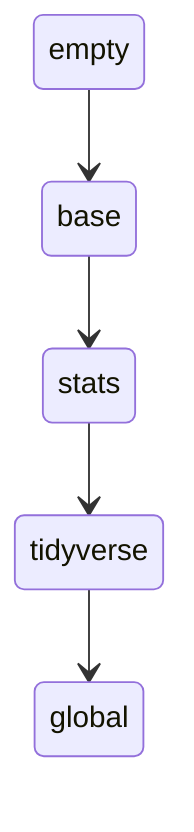
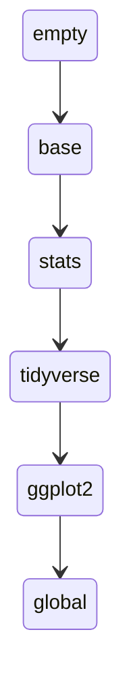
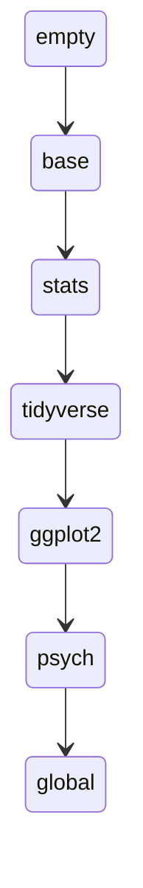
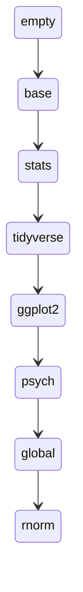

# Data types

---
level: 2
---

# Data types 

- Numeric
  - Numbers with decimals
  - `R` only uses _double precision_
  - Numbers are stored with 64 bits of data
  - 1 bit stores the sign: $\pm$
  - 11 bits store the exponent: between $-1022$ and $+1023$
  - 52 bits store the significant: between 15-17 significant digits
- Integer
  - Numbers without decimals
  - Can be exactly represented from $−9,007,199,254,740,992$ to $9,007,199,254,740,992$
  - Larger integers are rounded


---
level: 2
---
 
# Data types
  
- Character
  - Used to store text
  - Also called strings
- Factor
  - Categorical variables
  - Text labels for each possible value called "levels"
  - Factors can be ordered or unordered
  - These can behave weirdly, often best to store data as character strings until you need to do something that requires factors
- Logical
  - Take the values `TRUE` and `FALSE`
  - Can be abbreviated `T` and `F`
  - Under the hood, these take the value `1` and `0`
  
---
level: 2
---
 
# Data types

- `class()` will tell you what type of thing an object is
- The `as.` functions will cast one object to an object of a different type

```r
as.numeric()
as.character()
as.factor()
```

- The `is.` functions ask the question, "is the object this type?"
  - They return a logical object (i.e., `TRUE` or `FALSE`)

```r
is.numeric()
is.character()
is.factor()
```

---
level: 2
---

# Vectors, lists, and data frames

- Vectors are combinations of objects stored in a single object
  - we make them using the function `c()` (think: _combine_)
  - In `R`, vectors have the property that everything in them must be the same object type
    - This not true of all programming languages
    - This means when you try to combine numbers and strings in a vector, everything is cast to a string
- Lists are _also_ combinations of objects stored in a single object
  - Individual elements of a list can be named (and subsequently fished out using `$`)
  - Lists do not require that every object inside them is the same type
- Dataframes are _also_ combinations of objects stored in a single object
  - Dataframes are, specifically, combinations of _vectors_
  - Dataframes are _also_ lists, so each element can be named
  - Dataframes enforce that every element is the same length

---
level: 1
layout: section
---

# Environments


---
level: 2
---

# Environments

- Environments associate (bind) _names_ to _values_
- We typically work in the _global environment_
- Environments have _parents_
- Executing a function creates a new environment, with the global environment as the parent
- Loading a package adds that package as the parent of the global environment

---
level: 2
---

# Environments

- _Scoping_ allows environments to inherit name-value bindings from their parents
  - When you ask for something by name, `R` will look in the current environment first
  - If it can’t find the thing, it looks one environment up (function looks to global environment, then to the most recently loaded package, then the package before that, and so on)
  - If two packages have functions of the same name, calling it will use the most recently loaded version
- We can use the syntax `package::function()` to look in a specific environment for an object (like `dplyr::mutate()` or `mirt::fscores()`)


---
level: 2
---

# Environments

<div class="grid grid-cols-2 gap-10">
  <div>

```r {all|none|1|2|3|5|6}{lines:true}
library(tidyverse)
library(ggplot2)
library(psych)

x <- mean(1:10)
y <- rnorm(10)

```

  </div>
  <div>

<v-switch at='1'>
  <template #1>

  </template>
  <template #2>

  </template>
  <template #3>

  </template>
  <template #4>

  </template>
  <template #5>

  </template>
  <template #6>

  </template>
</v-switch>

</div>
</div>

---
level: 1
layout: section
---

# Built-in functions


---
level: 2
---

# Built-in functions

- Tons of very useful functions come pre-loaded in the `R` global environment
- These represent the capabilities `R` has without loading other packages
- Some to get you started:

```r
mean()     # find the mean of a standard vector
sd()       # find the standard deviation of a numeric vector
median()   # find the median of a numeric vector
sort()     # return a copy of a vector with the elements sorted
library()  # load a package as the parent of the current environment
floor()    # round a number down to the nearest integer
round()    # round a number to a specific decimal place
read.csv() # read a .csv file from disk into memory
```


---
level: 2
---

# Random number generation

- `R` (and computers) are horrible at generating truly random numbers
- What they do is produce _pseudorandom_ numbers
  - These are deterministic sequences
  - But they have the properties of random sequences when you look at subsets them!
- We want to sample from distributions, and there are four main functions we'll use in this course:

```r
rbinom() # draws samples from binomial distributions (i.e., weighted coin flips)
runif()  # draws samples from uniform distributions (i.e., each result is equally likely)
rnorm()  # draws samples from normal distributions (i.e., results closer to the mean are more likely)
sample() # draws samples from a specified object with specified probabilities and with or without replacement
```

- All of these are built-in!

---
level: 2
---

# `rbinom()`

- To read the documentation:
```r
?rbinom
```

- Usage:

````md magic-move {lines: true}
```r 
out <- rbinom(10, 1, 0.5)
```

```r
out <- rbinom(
  n = 10,    
  size = 1, 
  prob = 0.5  
)
```

```r 
out <- rbinom(
  n = 10,     # number of observations
  size = 1, 
  prob = 0.5
)
```

```r 
out <- rbinom(
  n = 10,     # number of observations
  size = 1,   # number of draws per observation
  prob = 0.5
)
```

```r 
out <- rbinom(
  n = 10,     # number of observations
  size = 1,   # number of draws per observation
  prob = 0.5  # probability of success on an individual draw
)
```
````

<div v-click>

- Output:
  - A vector of length `n` with each element being the total number of successful draws out of `size` 

</div>

---
level: 2
---

# `runif()`

- To read the documentation:
```r
?runif
```

- Usage:

````md magic-move {lines: true}
```r 
out <- runif(10)
```

```r 
out <- runif(10, 0, 1)
```

```r 
out <- runif(
  n = 10,
  min = 0,
  max = 1
)
```

```r 
out <- runif(
  n = 10,   # number of observations
  min = 0,
  max = 1
)
```

```r 
out <- runif(
  n = 10,   # number of observations
  min = 0,  # minimum value
  max = 1
)
```

```r 
out <- runif(
  n = 10,   # number of observations
  min = 0,  # minimum value
  max = 1   # maximum value
)
```
````

<div v-click>

- Output:
  - A vector of length `n` with numbers uniformly distributed between `min` and `max`

</div>

---
level: 2
---

# `rnorm()`

- To read the documentation:
```r 
?rnorm
```
- Usage:

````md magic-move {lines: true}
```r 
out <- rnorm(10)
```

```r 
out <- rnorm(10, 0, 1)
```

```r 
out <- rnorm(
  n = 10,
  mean = 0,
  sd = 1
)
```

```r 
out <- rnorm(
  n = 10,    # number of observations
  mean = 0,
  sd = 1
)
```

```r 
out <- rnorm(
  n = 10,    # number of observations
  mean = 0,  # mean of the distribution
  sd = 1
)
```

```r 
out <- rnorm(
  n = 10,    # number of observations
  mean = 0,  # mean of the distribution
  sd = 1     # standard deviation of the distribution
)
```
````

<div v-click>

- Output:
  - A vector of length `n` with numbers drawn from a normal distribution with the specified mean and standard deviation

</div>

---
level: 2
---

# `set.seed()`

- Remember how I said random numbers aren't random?
- These functions produce deterministic sequences!
- `set.seed()` takes a number as input and tells `R` "where to start" when doing things that involve randomness
- Setting a seed allows you to run the same code twice and get the same results both times, even if it's generating random numbers!